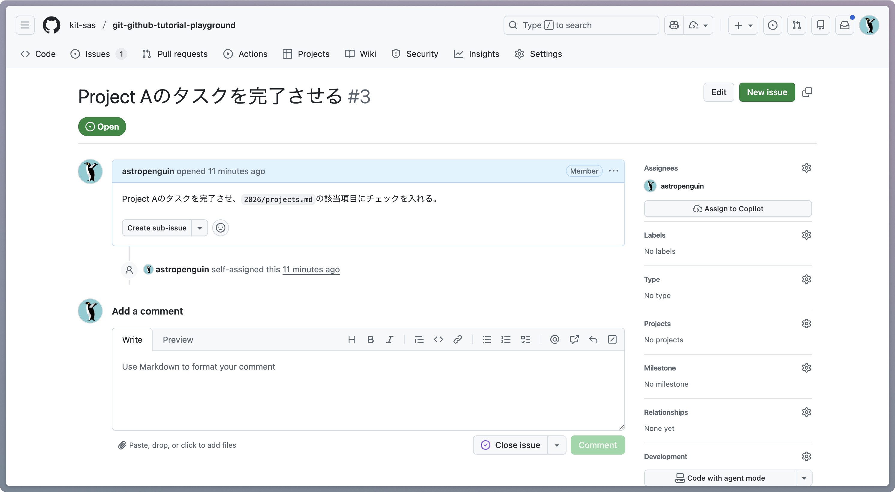
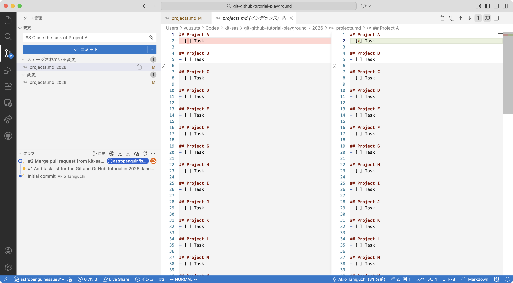

# Git and GitHub tutorial

**On: 2026-01-15 / At: 第1研究室 / By: 谷口暁星 / Ver: v2026.1.1**

- **目的**
    - 世界標準のバージョン管理システム[Git](https://git-scm.com/)と開発プラットフォーム[GitHub](https://github.com/)を使ったソフトウェア開発の方法をざっくり学ぶ
- **目標**
    - 実際にGitを使って[宇宙天文科学グループ](https://github.com/kit-sas)のリポジトリにコミット（コードを追加・登録）することで開発の流れを理解する

---

## Contents

1. バージョン管理とは何か・なぜ必要か
1. バージョン管理システムGit
1. ソフトウェア開発プラットフォームGitHub
1. GitとGitHubを使った開発の流れ
1. [テストリポジトリ](https://github.com/kit-sas/git-github-tutorial-playground)を使ったチュートリアル

---

## バージョン管理とは何か

- **バージョン管理（en: version control）**
    - ファイルやフォルダ内容のバージョン（変更履歴＝誰がいつどのような変更を加えたか）を保存して、変更内容を確認したり任意の時点に戻したりできるようにすること
- **バージョン管理システム（en: version control system or VCS）**
    - バージョン管理を支援するコマンドラインツールやアプリ
- **色々なバージョン管理システム**
    - Git, Subversion, Mercurial: コマンドラインツール
    - Windows バックアップ, macOS Time Machine: OSレベル

---

## バージョン管理はなぜ必要か

- **変更履歴の完全な追跡**
    - バグが発生した場合も発見や対処が容易。また、任意の時点の状態に戻れるので、開発環境の再現性が高い。
- **変更目的の明確化**
    - ファイル名や時刻による管理では、変更をなぜ加えたかが明確でない。意味単位で管理することが複数人での開発では重要。
- **バージョン管理の一元化**
    - 標準的なVCSを使うことで、共通の方法でバージョン管理でき、かつ変更履歴を一箇所に集約できる。

---


<!-- _footer: こうなることを避けたい… (https://tanisukestr.hatenablog.com/entry/2018/08/11/154820) -->

---

## バージョン管理システムGit

- **[Git](https://git-scm.com/)**
    - 2026年現在、ソフトウェア開発において最も使われているVCS
    - もともとは[Linuxのソースコード](https://github.com/torvalds/linux)管理のために作成された
- **分散型のバージョン管理**
    - リポジトリと呼ばれる、変更履歴を保存するデータベースのような仕組みを使ってバージョン管理する
    - ユーザーごとにローカルリポジトリを持ち変更内容を保存
    - ローカルリポジトリの変更内容を、サーバ上のリモートリポジトリに同期することで、複数ユーザーによる同時開発を実現

---

## バージョン管理システムGit

- **Gitの仕組み**
    - フォルダのある時点での中身（ファイル・サブフォルダ）をスナップショットとして保存し、これをバージョンとみなして管理する（:bulb: フォルダをzipしてバックアップを繰り返すイメージ）
- **重要な用語**
    - リポジトリ（en: repository）：複数のスナップショット（バージョン）とそれらの対応関係を保存したデータベースのようなもの
    - コミット（en: commit）：スナップショットを作成して変更を確定すること（またはバージョンそのものを指す場合もある）

---

## バージョン管理システムGit

- **Gitのリポジトリの可視化**
    - コミット履歴は有向グラフで表現されることが多い
        - ノード（頂点）：それぞれのコミット
        - エッジ（枝）：コミット間の対応関係（親子関係）
- **重要な用語**
    - ブランチ（en: branch）：枝の先頭のコミットを指すポインタ
      （:bulb: 付箋のイメージ：新規コミットで付箋が貼り直される）
    - マージ（en: merge）：2つのコミットから統合コミットを作成
    - メインブランチ（`main`）：リポジトリのデフォルトのブランチ

---


<!-- _footer: コミットは差分ではなく独立なスナップショット (https://git-scm.com/book/en/v2/images/snapshots.png) -->

---


<!-- _footer: これは間違った差分の考え方 (https://git-scm.com/book/en/v2/images/deltas.png) -->

---


<!-- _footer: ブランチを切ることで同時編集ができる (https://git-scm.com/book/en/v2/images/basic-rebase-2.png) -->

---

## バージョン管理システムGit

- **Gitのコミット**
    - コミットはスナップショットの他に様々な情報を持つ
        - コミットメッセージ：作業内容の要約（必須）
        - コミット日時：コミット作成時の時刻情報
        - コミッター情報：コミットした人の名前とメールアドレス
        - コミットID：自動生成される40文字のハッシュ値
        - 親のコミットIDs：どのコミットから派生したのか
    - コミットは適当な粒度で行う（多くの作業を詰め込まない）

---

## ソフトウェア開発プラットフォームGitHub

- **[GitHub](https://github.com)**
    - 全世界で[1.5億人以上](https://github.com/about)が利用する開発プラットフォーム
    - 様々な[オープンソースプロジェクト](https://github.com/topics/python?l=python&o=desc&s=forks)のバージョン管理・プロジェクト管理（バグ報告・新機能提案）に利用されている
- **主な機能**
    - Gitのリモートリポジトリのホスティング
    - イシュー（en: issue）によるプロジェクト管理
    - プルリクエスト（en: pull request）によるコラボレーション
    - GitHub Actionsによるテスト・ビルドなどの自動化

---

## ソフトウェア開発プラットフォームGitHub

- **天文学での利用例**
    - [解析パッケージの開発および管理](https://github.com/deshima-dev)
    - [制御プログラムの開発および管理](https://github.com/mao-wfs)
    - [データ解析スクリプトの管理および公開](https://github.com/eventhorizontelescope)
    - [ドキュメンテーションの公開](https://github.com/astropenguin/azely)
    - [論文・プロシーディング執筆](https://github.com/astropenguin/ss-2020-proceedings)
- **ちなみにこのスライドもGitHubで管理しています**
    - [kit-sas/git-github-tutorial-slides](https://github.com/kit-sas/git-github-tutorial-slides)

---


<!-- _footer: DESHIMAプロジェクトにおけるバージョン管理 (https://github.com/deshima-dev/decode) -->

---


<!-- _footer: DESHIMAプロジェクトにおけるドキュメンテーション公開 (https://deshima-dev.github.io/decode) -->

---

## [GitとGitHubを使った開発の流れ](https://guides.github.com/introduction/flow/)

1. GitHub上にリモートリポジトリを作成
1. GitHub issuesに機能追加等のissueを作成→issue番号取得
1. ローカルにリポジトリをコピー（クローン）する
1. ローカルでIssue番号付きのトピックブランチを作成
1. ローカルで新機能をコミット→プッシュ
1. プルリクエストでトピックブランチを`main`ブランチにマージ
    - この際に他の人によるレビューや自動テストを受ける
    - ダメだったら修正をコミット→プッシュしてやり直し

---


<!-- _footer: ©︎ 2022 GitHub, Inc. (https://guides.github.com/pdfs/githubflow-online.pdf) -->

---

## GitとGitHubを使った開発の流れ

- **なんでこんな面倒なことをするのか？**
    - Issueとトピックブランチ（en: topic branch or feature branch）
        - 一連のコミットの目的を明確化させるとともに、開発者が一つの機能開発に集中できるようにするため
        - （逆に言うと複数の作業を一度に行わせないようにするため）
    - プルリクエスト（en: pull request or merge request）
        - トピックブランチを`main`ブランチにマージする前にレビューやテストを強制することで、バグを未然に防ぐため
        - 第三者からの提案を安全な形で受けられる（social coding）

---

## テストリポジトリを使ったチュートリアル

- **事前準備**
    - Gitの各自マシンへのインストール（[Windows](https://git-scm.com/install/windows), [macOS](https://git-scm.com/install/mac)）
    - [VS Code](https://code.visualstudio.com/Download)の各自マシンへのインストール
    - [GitHubアカウントの作成](https://github.com/signup)
        - :warning: ユーザー名は公開されます（例：[astropenguin](https://github.com/astropenguin)）
        - :warning: メールアドレスはデフォルトでは公開されますので、追加の非公開設定を推奨します（次ページ）

---

## テストリポジトリを使ったチュートリアル

- **事前準備（続き）**
    - GitHub登録メールアドレスの非公開設定
        1. アカウント作成後に[メール設定](https://github.com/settings/emails)にアクセス
        1. `Keep my email addresses private`の設定をON
        1. :white_check_mark: 生成されたダミーの公開アドレスを控えておく
           （例：<13254278+astropenguin@users.noreply.github.com>）
    - GitHubアカウントの[宇宙天文科学グループ](https://github.com/kit-sas)への登録
        - :white_check_mark: 谷口にGitHubアカウント名を教えてください！

---

## テストリポジトリを使ったチュートリアル

- **リモートリポジトリのクローン（en: clone）**
    - [リモートリポジトリ](https://github.com/kit-sas/git-github-tutorial-playground)をクローンしローカルリポジトリを作成する
    - ローカルリポジトリをVS Codeで開く
      ```shell
      $ git clone https://github.com/kit-sas/git-github-tutorial-playground.git
      $ code git-github-tutorial-playground # またはVS Codeで当該フォルダを選択して開く
      ```
- **VS Codeの機能の概観**
    - VS Codeのエクスプローラ・ソース管理の機能を確認する
    - ソース管理のグラフ表示でコミット履歴を確認する

---

## テストリポジトリを使ったチュートリアル

- **Gitの初期設定（ローカル）**
    - `ctrl-backquote`でVS Codeのターミナルを開いて以下を設定する
      ```shell
      $ git config --global user.name "<your name in romaji>"
      $ git config --global user.email "<your (dummy) public email address>"
      ```
- **GitHub issueの作成（GitHub）**
    - [New issue](https://github.com/kit-sas/git-github-tutorial-playground/issues)からissueを作成する
      （例：[Project Aのタスクを完了させる #3](https://github.com/kit-sas/git-github-tutorial-playground/issues/3)）
    - :white_check_mark: 発行されたissue番号（例：`#3`）を各自で控えておく

---



<!-- _footer: GitHub上で作成されたissue: [Project Aのタスクを完了させる #3](https://github.com/kit-sas/git-github-tutorial-playground/issues/3) -->

---

## Playgroundを使ったチュートリアル

- **トピックブランチの作成（ローカル）**
    - VS Codeでブランチを作成する（`⌘⇧P` → create branch）
    - ブランチ名にはissue番号を含める（例：`astropenguin/issue3`）
    - :white_check_mark: VS Codeのボトムバーに作成したブランチ名が表示されていることを確認して次に進む
- **ファイルやコードを編集する（ローカル）**
    - ここでは`2026/projects.md`の該当タスクにチェックを付ける
      （例：`- [ ] Task` → `- [x] Task`と変更する）
    - :white_check_mark: VS Codeのソース管理で正しい差分であることを確認する

---


<!-- _footer: VS Codeのコマンドパレットで「ブランチの作成」を選択 -->

---


<!-- _footer: VS Codeのコマンドパレットで作成するブランチ名を入力 -->

---


<!-- _footer: ファイルの編集後の差分の確認（ここでは意図的にProject Aに加えてBのタスクも編集している） -->

---

## Playgroundを使ったチュートリアル

- **変更をステージする（ローカル）**
    - VS Codeのソース管理からコミットしたい変更箇所をステージ
    - :white_check_mark: コミットしたい変更箇所のみステージされ、そうでない変更箇所（あれば）はステージされていない状態であることを確認
- **変更をコミットする（ローカル）**
    - VS Codeのソース管理からステージした変更箇所をコミットする
    - コミットメッセージの先頭にはissue番号を含めると良い
      （例：`#3 Close the task of Project A`）
    - :white_check_mark: グラフ表示で作成されたコミット（ノード）を確認

---


<!-- _footer: Project Aのタスクの完了チェックをステージした状態 -->

---


<!-- _footer: Project Bのタスクの完了チェックはステージされていない（コミット対象から除外） -->

---



<!-- _footer: コミットメッセージを入力した状態（メッセージ先頭にissue番号#3を入れておく） -->

---


<!-- _footer: コミットが完了した状態（グラフ表示で新規コミットがノードで表示されている） -->

---

## Playgroundを使ったチュートリアル

- **変更をプッシュする（ローカル→GitHub）**
    - リモートブランチへプッシュする（`⌘⇧P` → publish branch）
    - :white_check_mark: ソース管理のグラフ表示でプッシュされたことを確認
- **変更をマージする（GitHub）**
    - [New pull request](https://github.com/kit-sas/git-github-tutorial-playground/compare)からトピックブランチを`main`ブランチにマージするためのプルリクエストを作成する
    - `base: main`、`compare: <作成した自分のブランチ名>`となるようにする
    - レビュワーを誰か一人指定する（例：[astropenguin](https://github.com/astropenguin)）
    - :white_check_mark: レビューが通ったらMerge pull requestからマージする

---


<!-- _footer: 初回プッシュ時はブランチの発行が必要（ボトムバーのクラウドアイコン:cloud:からでも可能） -->

---


<!-- _footer: GitHub上でのPull requestの作成画面（[Close the task of Project A](https://github.com/kit-sas/git-github-tutorial-playground/pull/4)） -->

---


<!-- _footer: レビューが完了したらmainブランチへのマージコミットを作成する -->

---


<!-- _footer: Mainブランチへのマージが完了したら、Delete branchで不要になったトピックブランチを削除する -->

---


<!-- _footer: VS Codeでmainブランチを見ると、リモートリポジトリが更新されていることが分かる -->

---


<!-- _footer: リモートブランチの変更を同期（プル）した状態（ボトムバーの:repeat:からでも可能） -->

---

## 参考文献

- [Pro Git](https://git-scm.com/book/ja/v2)
    - Git公式ウェブサイトの日本語による詳細な解説。CUIの説明で難しいかもだが、最も信頼できるソースなのでぜひ一読を。
- [サル先生のGit入門](https://backlog.com/ja/git-tutorial/)
    - 豊富なイラストで初心者にも分かりやすいサイト。ただし、「差分をコミット」など一部記述が正しくない箇所もあるので注意。
- [Understanding the GitHub flow · GitHub Guides](https://guides.github.com/introduction/flow/)
    - 今回紹介した開発の流れ（GitHub flow）の公式の説明。なお、[git flowなど他のブランチの運用方法もあります](https://www.atmarkit.co.jp/ait/articles/1708/01/news015.html)。
